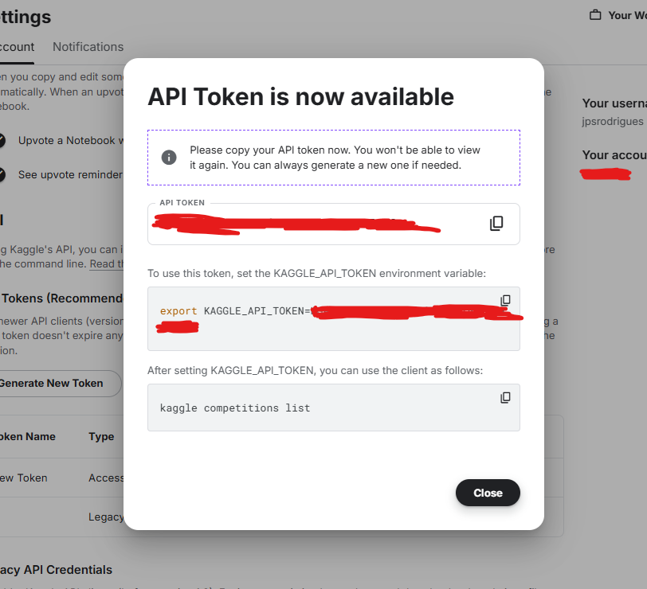
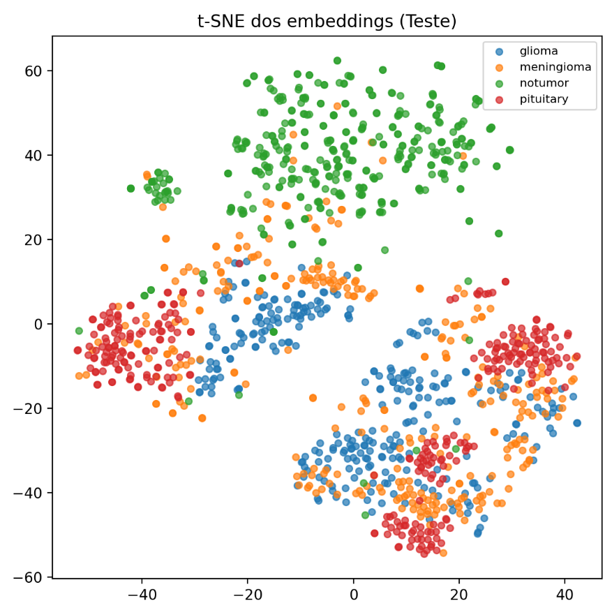

# Brain_Tumor_Predictor

João Paulo de Souza Rodrigues
21.01809-0

Este repositório contém um pipeline completo para **classificação de tumores cerebrais em imagens de ressonância magnética (RM)** utilizando **deep learning** com **MobileNetV2** e **transfer learning**.

### Para uma documentação mais detalhada, por favor verificar o relatório Trabalho_Final_IA_CD_Aplicadas_a_Saude.docx. Neste documento está explicado detalhadamente o que foi realizado em cada uma das etapas abaixo e porquê determinados métodos foram utilizados. Esse arquivo README estará mais focado em resumir breviamente o que foi feito e auxiliar na execução local do projeto.

O modelo construído nesse projeto será responsável por analisar as imagens de RM cerebral (Sem a utilização de qualquer dado clínico) e classificar as imagens em 4 categorias:
 - Glioma
 - Meningioma
 - Pituitária
 - Sem tumor (Cérebro saudável)

> ⚠️ Observação: Por padrão, a pasta `dataset/` e o ambiente virtual não são versionados (`.gitignore`). Para executar o pipeline localmente, é necessário baixar o dataset e recriar a estrutura de diretórios descrita abaixo.

## 🔧 Tecnologias principais

- **Linguagem**: Python 3.13
- **Deep Learning**: TensorFlow / Keras  
- **Modelo base**: MobileNetV2 pré-treinada em ImageNet  
- **Processamento de imagens**: OpenCV, imutils  
- **Métricas e avaliação**: scikit-learn, matplotlib, t-SNE  
- **Download do dataset**: kagglehub

---

## 📁 Estrutura do repositório

```text
Brain_Tumor_Predictor/
├── .gitignore
├── kaggle.json                  # (não versionado por padrão)
├── README.md
├── requirements.txt
├── Trabalho_Final_IA_CD_Aplicadas_a_Saude.docx   # Relatório do projeto
└── src/
    ├── get_data.py               # Download do dataset via kagglehub
    ├── pre_processing.py         # Pré-processamento + data augmentation
    ├── brain_tumor_evaluator.py  # Avaliação do modelo treinado + gerar métricas/gráficos de desempenho
    └── brain_tumor_trainer.py # Separação dos dados de treinamento em treino/validação; treinamento do modelo com MobileNetV2
```

---

## 1. Pré-requisitos

- Python 3.13+ (Versão 3.13.0 recomendada).
- Git.
- GPU é recomendável, mas não obrigatória.
- Conta criada no Kaggle para a coleta dos dados da API.

## 2. Instalação 

Clone este repositório na pasta desejada e entre no diretório da aplicação atráves da execução desses comandos

### Powershell
```bash
git clone https://github.com/jpsrodrigues30/Brain_Tumor_Predictor.git
cd Brain_Tumor_Predictor
```

### Instalação das dependências do Python

Crie um ambiente virtual e instale as bibliotecas necessárias

### Powershell
```bash
# Crie o ambiente virtual 
python -m venv .venv

# Ative o ambiente virtual
## Windows:
.venv\Scripts\activate
## Linux:
source .venv/bin/activate

# Instale as dependências listadas no requirements:
pip install -r requirements.txt
```

## 3. Download do Dataset (Kaggle)

Para essa etapa, é necessário conter uma conta no portal Kaggle. Caso ainda não tenha, crie uma através do link https://www.kaggle.com/account/login?phase=startRegisterTab&returnUrl=%2Fdatasets%2Fmasoudnickparvar%2Fbrain-tumor-mri-dataset

Depois de criado, vá nas configurações do seu perfil e crie uma novo API Token. Assim que for criado, deve aparecer um popup similar a imagem abaixo


Copie o API Token gerado (Primeiro campo do popup) e crie um arquivo novo dentro do repositório

### Powershell
```bash
mkdir kaggle.json
```

Depois de criado, edite o arquivo com o seu nome de usuário no Kaggle e o API Token récem coletado:

```json
{"username":"username","key":"token_api"}
```

Com isso feito, execute o arquivo get_data.py para fazer o download do dataset. Por padrão, os dados baixados serão armazenados dentro do diretório dataset/raw:

```bash
python src/get_data.py
```

## 4. Pré-Processamento das Imagens
Nessa etapa, será executado o arquivo responsável pelo pré-processamento e data augmentation das imagens coletadas no kagglehub, deixando elas preparadas para o treinamento do modelo. É nesse ponto que serão realizadas as seguintes tarefas:

### Pré-Processamento:
 - Filtragem para uso apenas de arquivos de imagem válidos (.png, .jpg, .jpeg, .bpm, .tif, .tiff);
 - Recorte automático da região encefálica;
 - Redimensionamento das imagens (224x224);
 - Aplicação do CLAHE;
 - Normalização com z-score, com reescala para [0,1];
 - Salvar as imagens "limpas" (pré-normalização) dentro da pasta "dataset/clean" ;
 - Realização de data augmentation no conjunto de treino;
 - Salvar os imagens normalizadas, que serão utilizadas no treinamento, no formato .npy, dentro do diretório "dataset/normalized".

```bash
python src/pre_processing.py
```

Exemplo de como a estrutura de arquivos dentro da pasta "dataset" deve ficar nesse momento:
dataset/
├── raw/
│   ├── Training/...
│   └── Testing/...
├── clean/
│   ├── Training/...
│   └── Testing/...
└── normalized/
    ├── Training/
    │   ├── glioma/*.npy
    │   ├── meningioma/*.npy
    │   ├── notumor/*.npy
    │   └── pituitary/*.npy
    └── Testing/
        ├── glioma/*.npy
        ├── meningioma/*.npy
        ├── notumor/*.npy
        └── pituitary/*.npy

## 5. Treinamento do modelo
### Arquitetura do modelo utilizada:
 - MobileNetV2 pré-treinada
 - Camadas finais:
    GlobalAveragePooling2D
    Dropout(0.2) — redução de overfitting
    Dense(4, activation="softmax") — saída com 4 classes (glioma, meningioma, pituitary, notumor)

### Configuração do treinamento:
 - Otimizador: Adam, learning_rate = 1e-4
 - Função de perda: sparse_categorical_crossentropy
 - Métrica principal: accuracy
 - Divisão treino/validação: ~80% / 20% (estratificada por classe)
 - Tamanho de batch: 32
 - Número de épocas: até 20 (com parada antecipada)
 - Callbacks:
    EarlyStopping (monitorando val_loss, com patience=5)
    ReduceLROnPlateau (reduz LR quando validação estagna, com min_lr=1e-6)

```bash
python src/brain_tumor_trainer.py
```
## 6. Avaliação do modelo
Modelo treinado salvo no diretório:

trained_model/
├── model.keras       # modelo Keras salvo
└── classes.txt       # mapeamento de índices -> nomes de classes

Nessa etapa será realizada a avaliação do desempenho do modelo sobre o conjunto de teste, um grupo de dados separado e completamente independente do conjunto utilizado no treinamento e validação do modelo na etapa anterior. Os arquivos utilizados aqui podem ser encontrados no seguinte diretório:
dataset/normalized/Testing/
    ├── glioma/*.npy
    ├── meningioma/*.npy
    ├── notumor/*.npy
    └── pituitary/*.npy

Esses dados, diferentemente dos dados de treianmento, não sofreram data augmentation.

### Métricas calculadas:
 - Acurácia
 - Precisão
 - Recall
 - F1 Score
 - MCC
 - Kappa
 - Matriz de confusão
 - Curvas ROC e AUC
 - Visualização 2D com t-SNE dos embeddings internos

Todas essas métricas/gráficos são salvas dentro da pasta results
results
    ├── confusion_matrix_test.png       # matriz de confusão
    ├── metrics_test_first_run.txt      # arquivo .TXT com os valores registrados para cada uma das métricas de desempenho
    ├── roc_curves_test.png             # curvas ROC e AUC
    ├── training_results_first_run.txt  # arquivo .TXT com os resultados do treinamento do modelo
    └── tsne_embeddings_test.png        # gráfico 2D com t-SNE

```bash
python src/brain_tumor_evaluator.py
```

## 7. Resultados Obtidos
=== MÉTRICAS GERAIS (TESTE) ===
Acurácia:  0.8841
Precisão:  0.8827
Recall:    0.8841
F1-Score:  0.8824
MCC:       0.8449
Kappa:     0.8443

Matriz de confusão:
[[248  44   0   8]
 [ 20 230  23  33]
 [  5   5 394   1]
 [  4   8   1 287]]
Classes:
['glioma', 'meningioma', 'notumor', 'pituitary']



